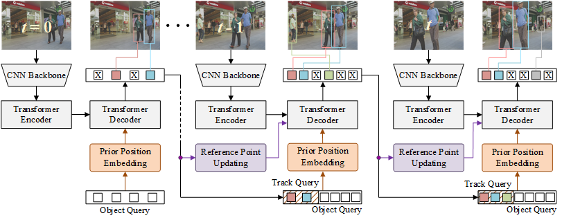

# TrackFormer with Prior Position Embedding and Reference Point Updating for Multi-Object Tracking
## Abstract

<div align="justify">
The recently proposed TrackFormer has established a fully end-to-end framework with the concepts of object query and track query for multi-object tracking (MOT). TrackFormer,which is based on the deformable attention mechanism, heavily depends on the keypoint sampling, where a set of keypoints is sampled around the so-called reference point for the subtasks of object detection and data association in MOT. However, the keypoint sampling is still not effective due to the absence of prior position information and the inaccuracy of the reference point, which leads to degraded tracking performance. In this paper, we propose TrackFormer++ to address this issue of the ineffective keypoint sampling through the strategies of prior position embedding and reference point updating. In the proposed TrackFormer++, the reference point for object detection is utilized as the prior position and explicitly embedded into the object query. Similarly, the reference point for data association is adaptively updated according to a predicted offset relative to the object center in the previous frame. Extensive experiments by the public and private detection on the MOT17 and MOT20 datasets demonstrate that TrackFormer++ achieves superior or comparable performance to the state-of-the-art baselines.
</div>

<div align="center">
    
</div>

## Installation

Please refer to our [docs/INSTALL.md](docs/INSTALL.md) for detailed installation instructions.

## Train TrackFormer

Please refer to our [docs/TRAIN.md](docs/TRAIN.md) for detailed training instructions.

## Evaluate TrackFormer++

<div align="justify">
In order to evaluate TrackFormer++ on a multi-object tracking dataset, we provide the `src/track.py` script which supports several datasets and splits interchangle via the `dataset_name` argument (See `src/datasets/tracking/factory.py` for an overview of all datasets.) The default tracking configuration is specified in `cfgs/track.yaml`. To facilitate the reproducibility of our results, we provide evaluation metrics for both the train and test set.
</div>

### MOT17

#### Private detections

```
python src/track.py with reid
```

#### Public detections (DPM, FRCNN, SDP)

```
python src/track.py with \
    reid \
    tracker_cfg.public_detections=min_iou_0_5 \
    obj_detect_checkpoint_file=models/mot17_deformable_multi_frame/checkpoint_epoch_50.pth
```

### MOT20

#### Private detections

```
python src/track.py with \
    reid \
    dataset_name=MOT20-ALL \
    obj_detect_checkpoint_file=models/mot20_crowdhuman_deformable_multi_frame/checkpoint_epoch_50.pth
```

### Demo

To facilitate the application of TrackFormer, we provide a demo interface which allows for a quick processing of a given video sequence.

```
ffmpeg -i data/snakeboard/snakeboard.mp4 -vf fps=30 data/snakeboard/%06d.png

python src/track.py with \
    dataset_name=DEMO \
    data_root_dir=data/snakeboard \
    output_dir=data/snakeboard \
    write_images=pretty
```

<div align="center">
    
</div>

## Publication
If you use this software in your research, please cite our publication:

```

```
#https://motchallenge.net/data/MOT17/
#wget https://vision.in.tum.de/webshare/u/meinhard/trackformer_models_v1.zip
